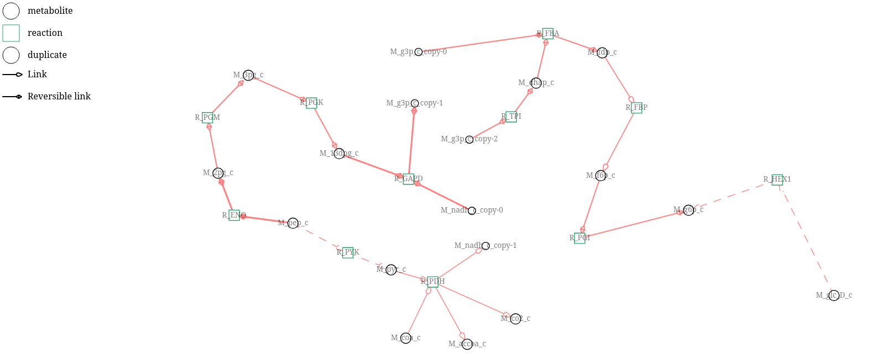

# Analyse des flux métaboliques sur un modèle genome-scale avec MetExplore

## Contexte
Ce projet présente l'analyse des flux métaboliques d’un modèle genome-scale de **Ralstonia solanacearum**.  
Les flux ont été calculés avec **COBRApy**, puis mappés sur le réseau métabolique de Ralstonia dans **MetExplore 3** pour visualisation et analyse.

---

## Contenu du dépôt
- **ralsto_metexplore3.xml** : Modèle SBML de Ralstonia solanacearum.  
- **fluxes_for_metexplore.csv** : Valeurs de flux des réactions, format tabulé pour MetExplore.  
- **essential_genes.csv** : Liste des gènes essentiels identifiés avec COBRApy.  
- **liste_voies.csv** : Résultats du mapping des gènes sur les voies métaboliques.  
- **graph.png** : Visualisation du sous-réseau glycolyse avec flux mappés.  
- **mod_cobraPy.ipynb** : Notebook Jupyter contenant toutes les analyses et visualisations.  

---

## Installation et utilisation
1. Installer les dépendances Python :
```bash 
pip install cobra pandas cplex
```
## Méthodes utilisées

- **Calcul des flux** : Optimisation FBA avec COBRApy.  
- **Gènes essentiels** : Analyse de délétion simple (`single_gene_deletion`) avec COBRApy.  
- **Mapping des flux** : Préfixe `R_` ajouté aux identifiants de réaction pour compatibilité MetExplore.  
- **Visualisation** : Sous-réseau glycolyse, composés ubiquitaires retirés ou dupliqués pour clarté.  
- **Analyse de voies** : Les gènes essentiels ont été mappés sur les voies métaboliques de Ralstonia via MetExplore.

---

## Résultats

- **Croissance optimale simulée** : 0.5119279935093644.  
- **Nombre de gènes essentiels identifiés** : 195 (cf. `essential_genes.csv`).  
- **Voies métaboliques contenant ces gènes** : 45 (cf. `liste_voies.csv`).  
- **Sous-réseau glycolyse visualisé dans le notebook** :



---

## Notes importantes

- Les fichiers tabulés pour MetExplore sont compatibles avec la fonction de mapping flux.  
- Les images sont incluses via fichiers externes dans le notebook pour éviter les erreurs “missing attachment” sur GitHub.  
- Pour toute analyse complémentaire ou modification du modèle, il est recommandé de travailler sur une **copie du modèle** afin de ne pas écraser l’original.

---

## Contact

Pour toute question concernant le projet vous pouvez contacter :

- **Auteur du notebook** : issa.kerima-khalil@utoulouse.fr
